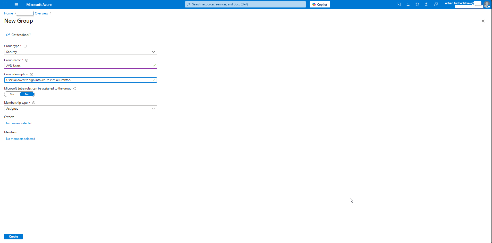
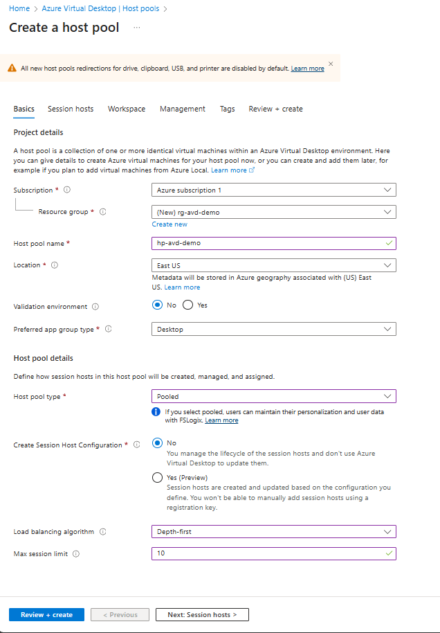
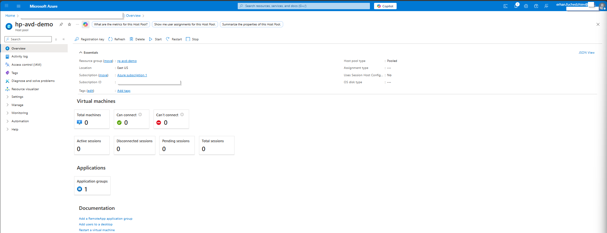
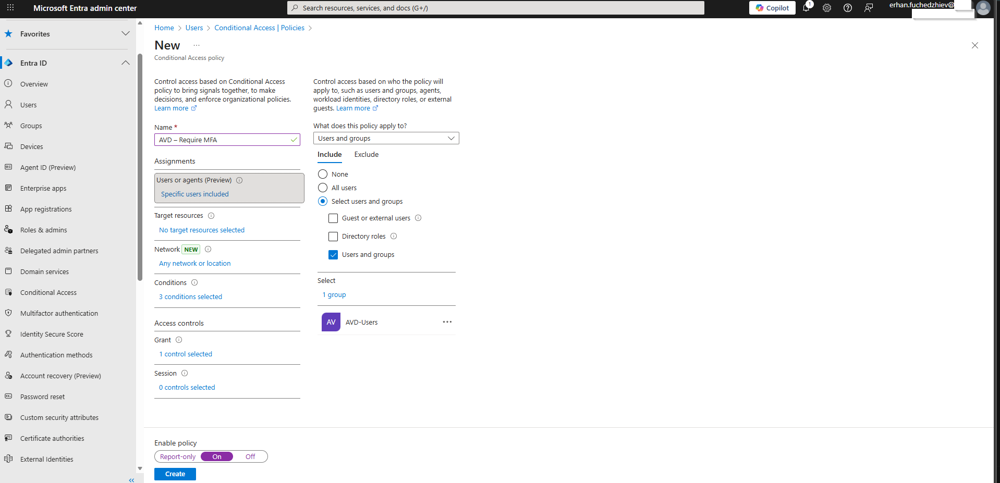
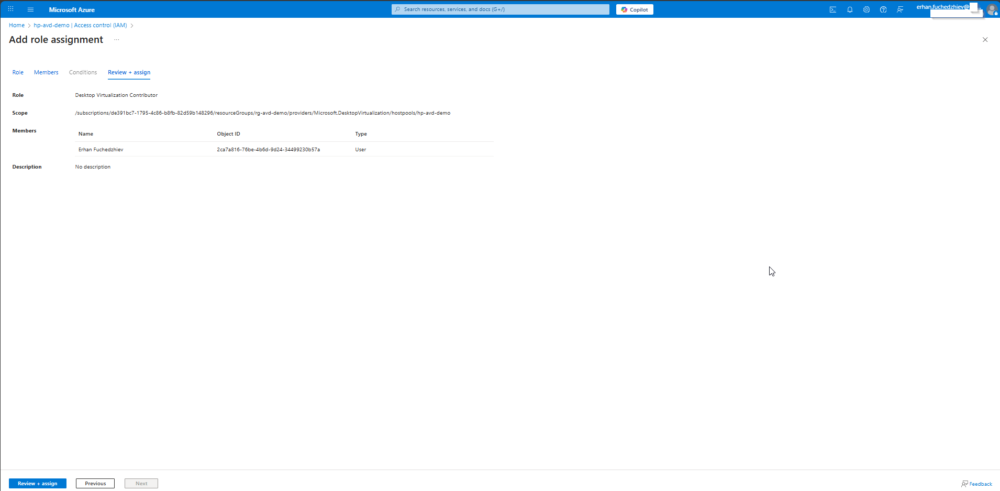

# 01 – Identity & Access Configuration for Azure Virtual Desktop (AVD)

Objective

This exercise describes all identity and access configurations required before deploying Azure Virtual Desktop (AVD).

These steps ensure:

- Users can sign in to AVD
- Administrators can manage the environment securely
- Conditional Access protects access
- RBAC roles are correctly assigned
- Hybrid or Entra ID Join decisions are documented
This is part of the Identity & Access Preparation phase for AVD implementation.

---

Prerequisites

- Microsoft Entra ID tenant
- Azure subscription
- Azure Virtual Desktop environment (host pool, workspace, application group)
- Licenses for Conditional Access (Entra ID P1 or higher)

---

## 1. Create Entra ID Security Groups

Create AVD-Users Group:

This group contains all users allowed to sign in to Azure Virtual Desktop.

Group type: Security  
Group name: AVD-Users  
Description: Users allowed to sign into Azure Virtual Desktop  
Membership type: Assigned

---

## 2️. Create the AVD Host Pool (Portal Walkthrough)

I created a new Host Pool named hp-avd-demo in the resource group rg-avd-demo.

Host Pool Configuration:

- Host pool type: Pooled
- Preferred app group type: Desktop
- Load balancing algorithm: Depth-first
- Max session limit: 10

Create session host configuration: Disabled (manual hosts will be added later)

After creation, I validated that the Host Pool was deployed successfully.

---

## 3️. Assign User Access to AVD (App Group & Host Pool)

Once the Host Pool was created, users from the AVD-Users group were assigned access to the Desktop Application Group.

This ensures users can see the published AVD desktops when signing in.

---

## 4️. Conditional Access Policies for AVD

I created a Conditional Access policy named “AVD – Require MFA” targeting the AVD-Users group.

Policy Controls:

- Require MFA
- Target selected users/groups
- Scope limited to AVD access only
- (Optional) Compliant device requirement can be added later

---

## 5️. Assign RBAC Roles (Portal IAM)

To manage AVD resources, I assigned the Desktop Virtualization Contributor role to myself at the Host Pool scope.

RBAC Assignment:

-Role: Desktop Virtualization Contributor
- Scope: /resourceGroups/rg-avd-demo/providers/Microsoft.DesktopVirtualization/hostpools/hp-avd-demo
- Assigned to: My user account

This role allows me to manage AVD components without granting unnecessary access across the subscription.

---

## 6️. Identity Join Decision (Planned)

For session hosts, I will choose between:

- Entra ID Join: Modern, cloud-native, supports SSO and passwordless authentication.

