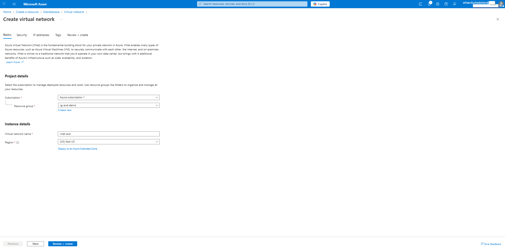
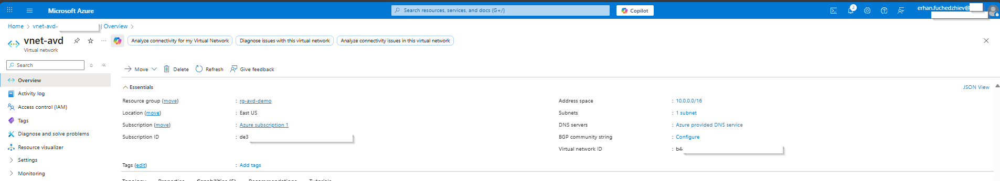
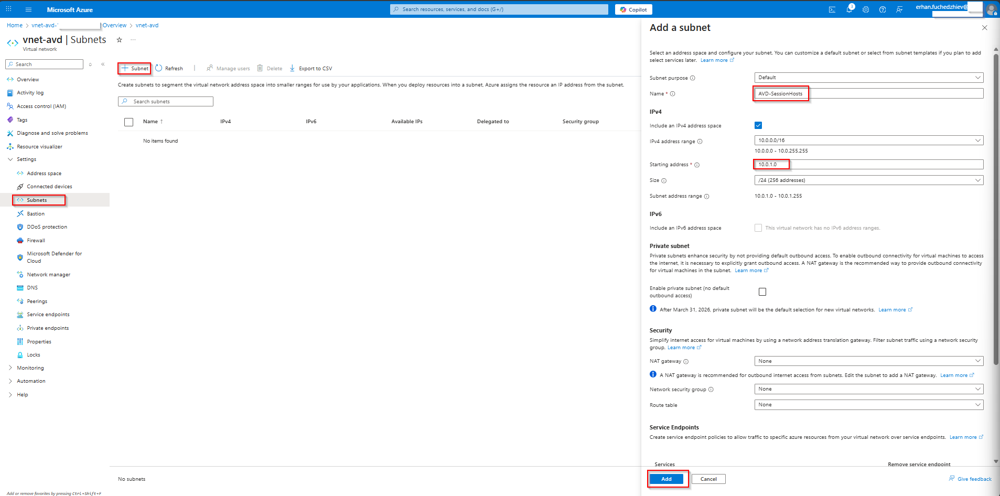
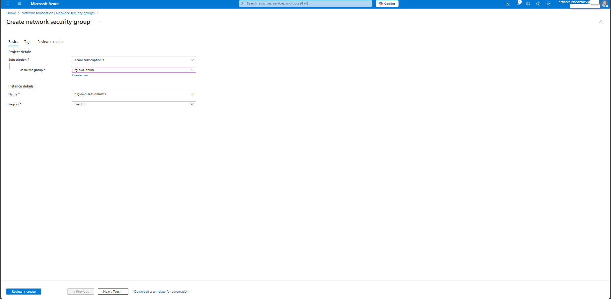
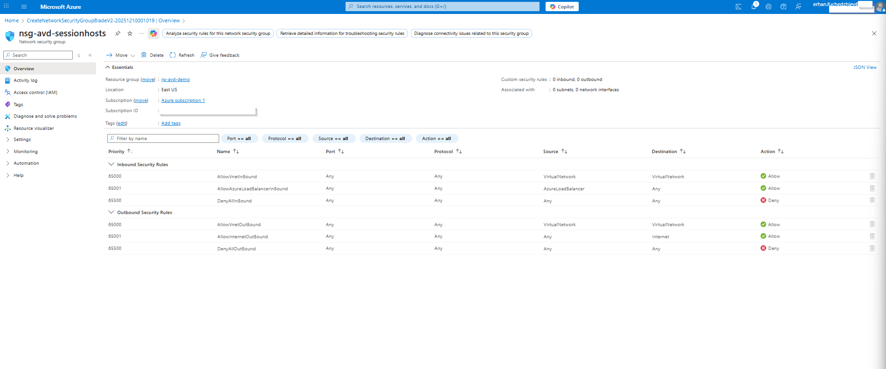
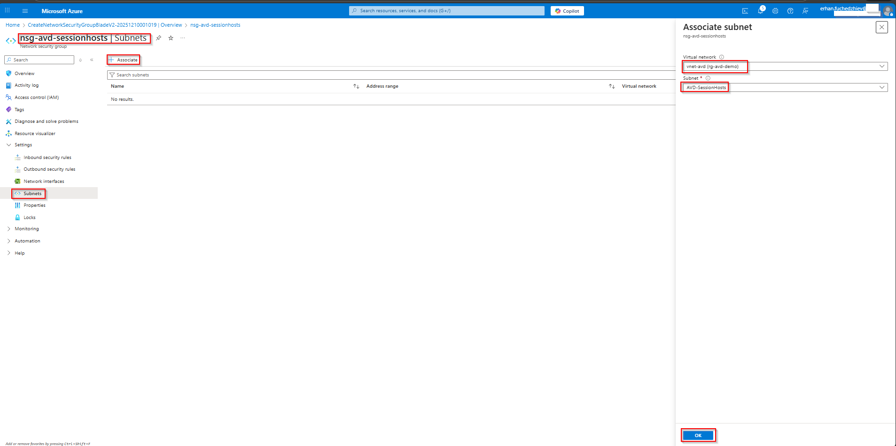

# 03 – Networking & Connectivity (Azure Virtual Desktop)

This section documents the required virtual network and connectivity configurations to support Azure Virtual Desktop (AVD).
It ensures session hosts have the appropriate network environment, subnets, and firewall/NSG settings needed for AVD to function properly.

---

## 1. Create Virtual Network (VNet)

In the Azure Portal, I created a Virtual Network for the AVD environment:

| Setting        | Value                |
| -------------- | -------------------- |
| Subscription   | Azure subscription 1 |
| Resource Group | rg-avd-demo          |
| VNet name      | `vnet-avd`           |
| Region         | East US              |
| Address space  | `10.0.0.0/16`        |

Once deployed, the VNet overview appears as follows:

---

## 2. Create Subnet for AVD Session Hosts

Within the newly created VNet, I added a dedicated subnet for session hosts:

| Setting        | Value                                      |
| -------------- | ------------------------------------------ |
| Subnet name    | `AVD-SessionHosts`                         |
| Subnet purpose | Default                                    |
| IPv4 range     | `10.0.1.0/24`                              |
| Private subnet | Disabled (default outbound access allowed) |
| Delegation     | None                                       |

Subnet configuration form before “Add”:
Subnet listed in VNet: This /24 subnet provides up to 256 IP addresses — enough for current and future AVD session hosts and related services.

---

## 3. Create & Associate Network Security Group (NSG)

To control and secure network traffic, I created an NSG and associated it with the AVD subnet.

### 3.1. Create NSG
| Setting        | Value                  |
| -------------- | ---------------------- |
| NSG name       | `nsg-avd-sessionhosts` |
| Resource Group | rg-avd-demo            |
| Region         | East US                |

---

### 3.2 Review Default NSG Rules

The NSG includes default inbound and outbound rules:

Inbound: Allow VNet, Load Balancer; Deny all others

Outbound: Allow VNet, Internet; Deny all others

These defaults are sufficient for AVD; no additional inbound rules are required.

---

### 3.3 Associate NSG with Subnet

The NSG is attached to the AVD-SessionHosts subnet, enforcing the defined rules on all session hosts.

---

## 4. Outbound Connectivity Requirements for AVD

Azure Virtual Desktop session hosts require outbound internet access to operate correctly. This includes:

- Registering with the AVD control plane
- Authenticating users via Entra ID / Azure AD
- Downloading updates, patches, and agent components
- Accessing FSLogix profile containers, storage, and diagnostics
- Communicating with Azure services (storage, management, telemetry)

Connectivity Configuration

- Outbound HTTPS (port 443) and internet access is permitted by default via NSG
- No custom outbound restrictions applied — ensures maximum compatibility
- If using a firewall or proxy, allow traffic to:
  - Azure service tags: AzureCloud, Storage, MicrosoftGraph, etc.
  - URLs such as *.wvd.microsoft.com, login.microsoftonline.com, *.blob.core.windows.net, and other Azure endpoints.

This ensures session hosts can stay connected to AVD control plane services and related dependencies.
