# 04. Session Hosts and Images

In this section I deploy my Azure Virtual Desktop (AVD) session host VM, configure Microsoft Entra join and single sign-on (SSO), create a workspace, assign users, and validate the end-to-end connection.

---

## 1. Add a Virtual Machine to the Host Pool

From Azure Virtual Desktop → Host pools, I open my host pool hp-avd-demo and select:

Session hosts → Add

Basics

I keep the defaults that link this VM to my existing host pool:

- Subscription: Azure subscription 1
- Resource group: rg-avd-demo
- Host pool: hp-avd-demo
- Location: East US
- Host pool type: Pooled
- Preferred app group type: Desktop

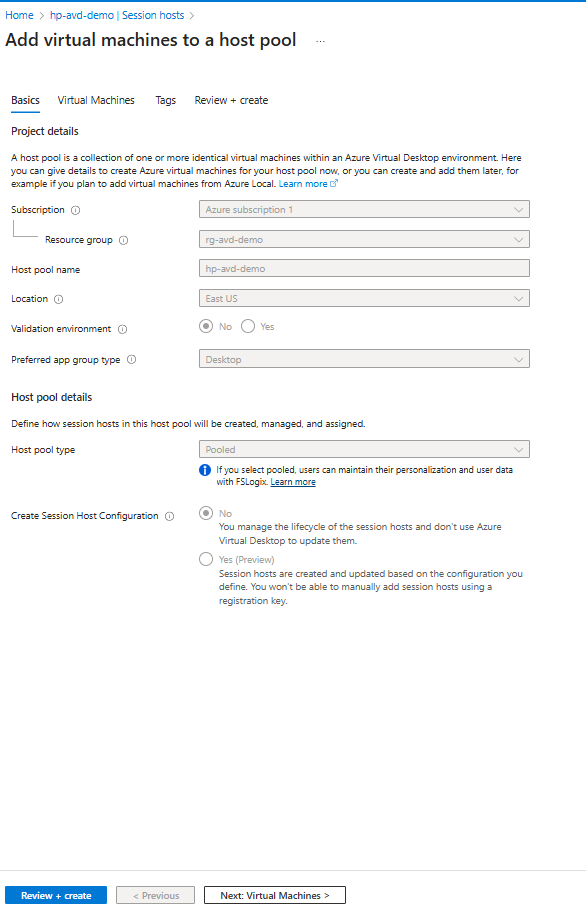

---

## 2. Configure the Virtual Machine

I continue to the Virtual Machines tab and configure the session host.

General VM Settings

- Add virtual machines: Yes
- Name prefix: sh-avd-demo
- Virtual machine type: Azure virtual machine
- Image: Windows 11 Enterprise multi-session, 24H2 + Microsoft 365 Apps
- VM size: Standard D2as v5
- Number of VMs: 1

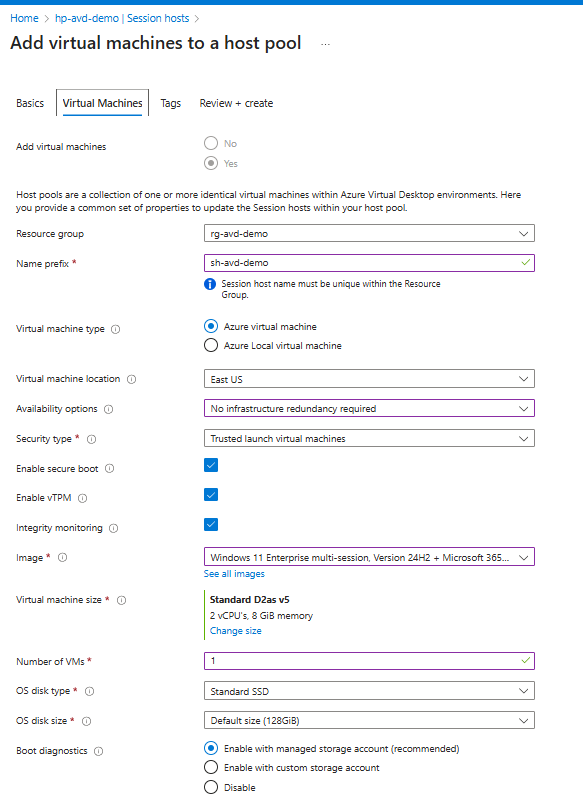

Networking & Identity

- Virtual network: vnet-avd
- Subnet: AVD-SessionHosts
- NSG type: Advanced
- NSG: nsg-avd-sessionhosts

Domain Join

- Join directory: Microsoft Entra ID
- Enroll in Intune: No

Local Admin Account

- Username: avdadmin

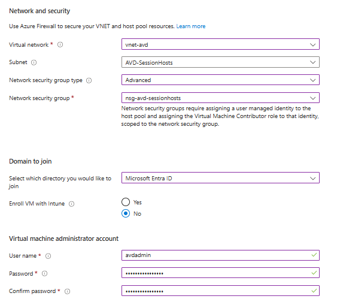

---

## 3. Verify the Session Host Deployment

After deployment completes, I return to the host pool → Session hosts, where I confirm:

- VM Name: sh-avd-demo-0
- Status: Running
- Health state: Available

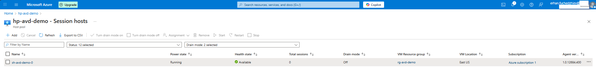

---

## 4. Create a Workspace

Next, I create a workspace that users will subscribe to.

Azure Virtual Desktop → Workspaces → Create

Basics

- Name: ws-avd-demo
- Resource group: rg-avd-demo
- Location: East US

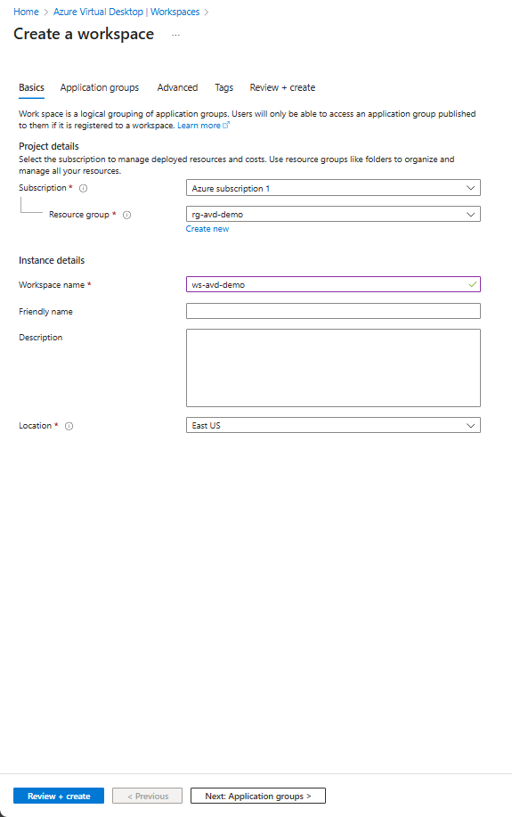

---

## 5. Register Application Groups

I register the Desktop Application Group (DAG) that belongs to the host pool.

- Register application groups: Yes
- Add: hp-avd-demo-DAG

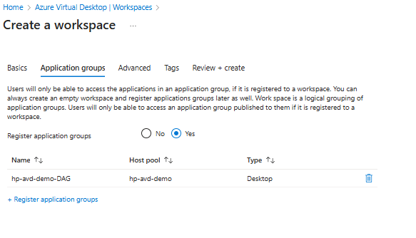

---

## 6. Assign Users to the Desktop Application Group

I open:

Azure Virtual Desktop → Application groups → hp-avd-demo-DAG → Assignments

Then I add my user: Erhan Fuchedzhiev

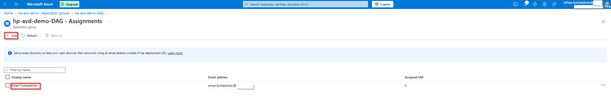

---

## 7. Enable Microsoft Entra Single Sign-On (SSO)

Within the host pool I configure SSO for seamless authentication:

Host pool → RDP Properties → Connection Information

- Microsoft Entra single sign-on: Connections will use Microsoft Entra authentication to provide single sign-on

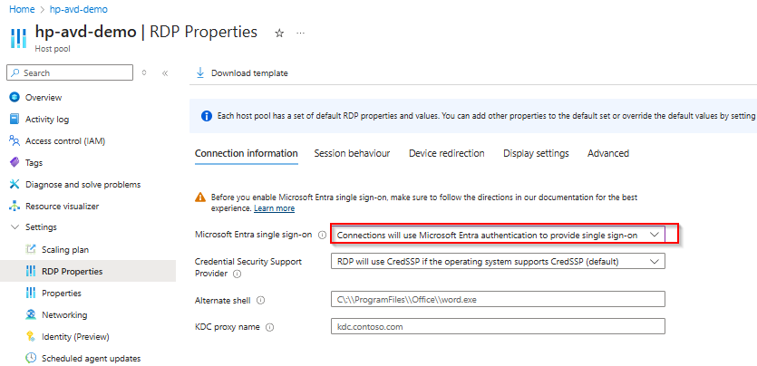

---

## 8. User Experience – Connecting From Windows App
Workspace Discovery

In the Windows App, after signing in with my Entra ID, I see:

Workspace: ws-avd-demo
Resource: SessionDesktop

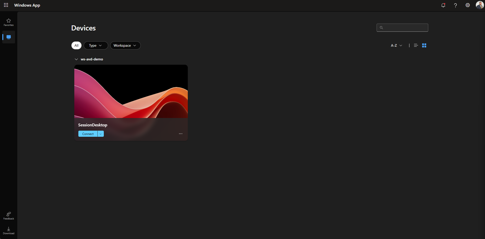

---

Authentication Prompt: When launching the session, I confirm the remote desktop connection request:

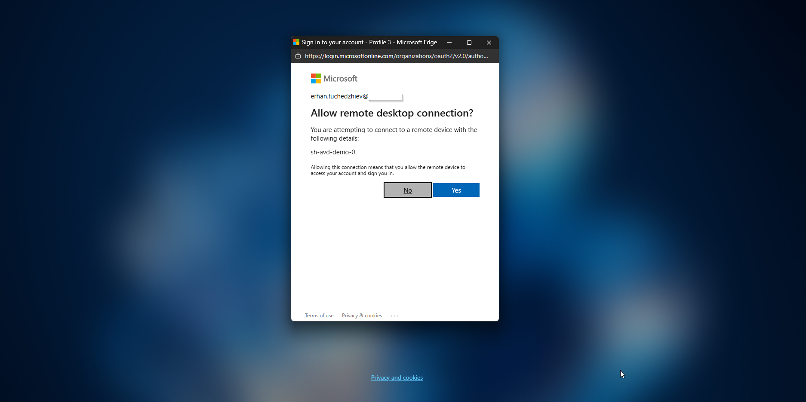

---

Successful Connection: The Remote Session Desktop opens, and I am signed in automatically using SSO.

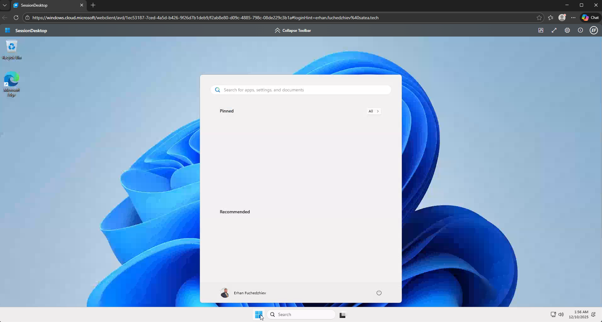
