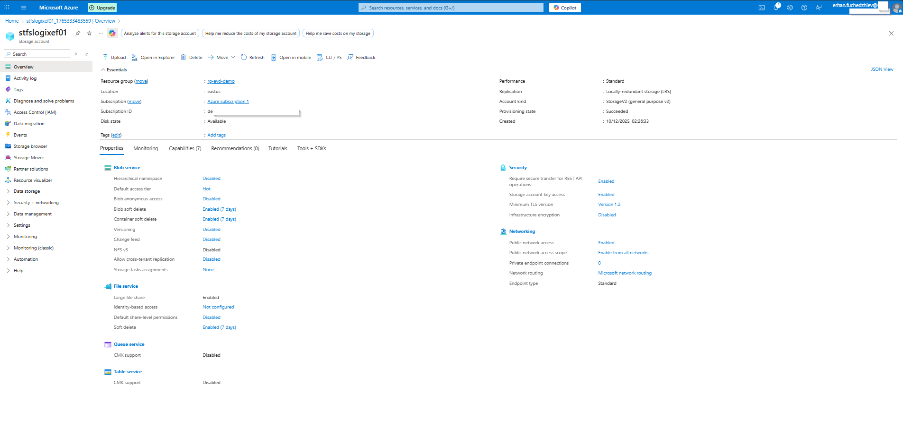
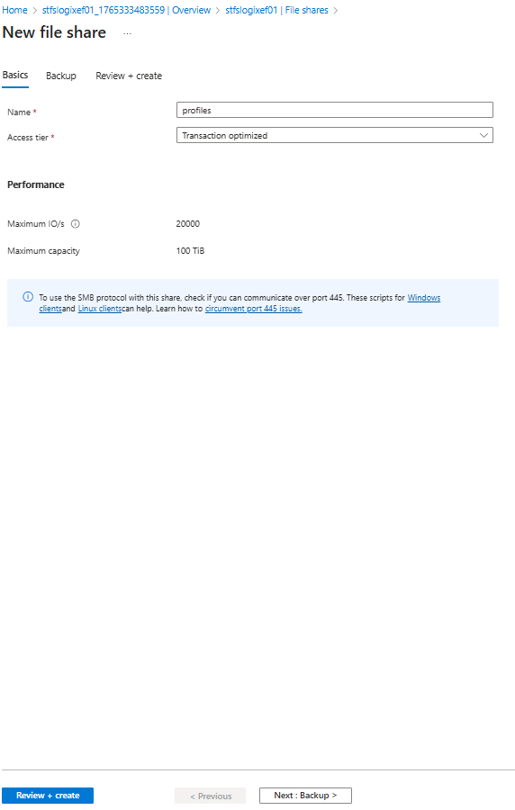
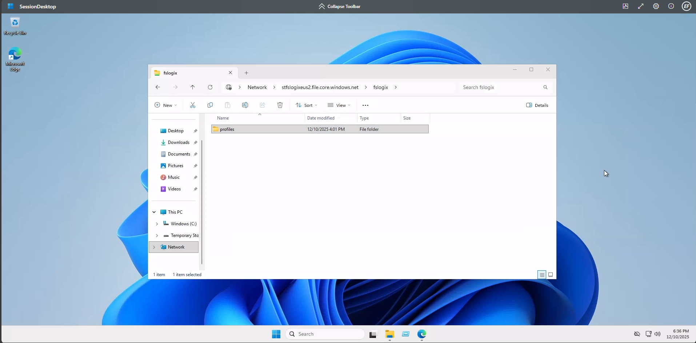
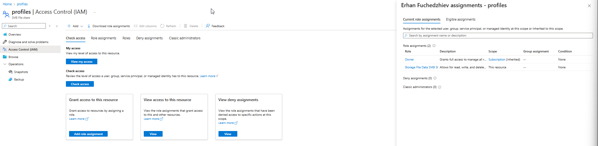
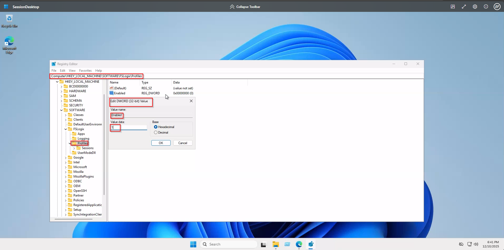
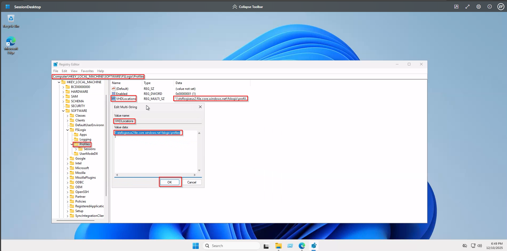

# 05 – FSLogix Profiles and Storage Configuration

This section of the project describes how I configure FSLogix Profile Containers for Azure Virtual Desktop (AVD). The goal is to create a centralized, scalable, and secure storage solution for user profiles using Azure Files and FSLogix.

FSLogix improves profile performance, reduces logon time, and provides a consistent user experience across session hosts.

---

## Overview

FSLogix stores user profiles inside a VHD(X) file on a file share. To support this architecture, I configure:

- Azure Files with SMB access
- Role assignments for secure profile storage
- Registry configuration for FSLogix clients
- Validation that Azure AD authentication works correctly

The screenshots captured throughout this process ensure reproducibility and documentation clarity.

---

## 1. Create the Storage Account

I start by creating a new StorageV2 account that will hold the FSLogix file share.

Key settings selected:

- Preferred Storage Type: Azure Files
- Performance Tier: Standard
- Redundancy: Locally Redundant Storage (LRS)
- Subscription & Resource Group: Defined for the AVD environment


Once created, I can review the configuration in the Azure portal.



---

## 2. Create the FSLogix File Share

Inside the storage account, I create a new SMB file share named: profiles

Configured with:

- Access Tier: Transaction optimized
- Maximum IOPS: 20,000
- Capacity: 100 TiB



Later I confirm the folder structure from a session host via UNC path: \\<storageaccountname>.file.core.windows.net\fslogix\profiles



---

## 3. Enable Azure AD Kerberos for Azure Files

Azure AD Kerberos allows domain-joined and Azure AD–joined machines to authenticate to Azure Files without password-based authentication.

Using PowerShell:

```bash
Set-AzStorageAccount `
  -ResourceGroupName "rg-avd-demo" `
  -Name "stfslogixef01" `
  -EnableAzureActiveDirectoryKerberosForFile $true
```


This step is required for modern AVD environments that rely on Azure AD authentication rather than traditional AD DS.

---

## 4. Configure IAM Permissions

To allow FSLogix clients to create and manage profile containers, I assign:

Storage File Data SMB Share Contributor

This role provides:

- Read
- Write
- Delete
permissions on the profile container share.



---

## 5. Validate Access to the File Share

From a session host, I verify that the share is reachable over SMB and that the authenticated user can access it.

UNC example: \\stfslogixeus2.file.core.windows.net\fslogix\profiles

Successful access is shown in the screenshot.


---

## Configure FSLogix on the Session Host

FSLogix settings are applied through registry modifications under: HKLM\SOFTWARE\FSLogix\Profiles

Enable FSLogix

Set the following DWORD: Enabled = 1



Define VHD(X) Profile Storage Path:

- Create or edit the multi-string value: VHDLocations
- Set it to the Azure Files UNC path: \\stfslogixeus2.file.core.windows.net\fslogix\profiles



This ensures FSLogix mounts the user’s VHD(X) during sign-in.

---

## 7. Verify Azure AD Join and Device Registration

I run the following command on the AVD session host: dsregcmd /status

Key items verified:

- AzureADJoined = YES
- EnterpriseJoined = NO
- DeviceAuthStatus = SUCCESS
- Tenant ID matches AAD environment
- KerbSvrURL present → confirms ability to use Azure AD Kerberos


This ensures the session host can authenticate correctly against Azure Files using Kerberos.

---

Conclusion

In this section, I successfully:

- Created and configured Azure Files storage for FSLogix
- Enabled Azure AD Kerberos for secure authentication
- Assigned appropriate IAM permissions
- Configured FSLogix settings on the session host
- Verified the environment using dsregcmd /status

This completes the FSLogix Profile Container setup for Azure Virtual Desktop.
