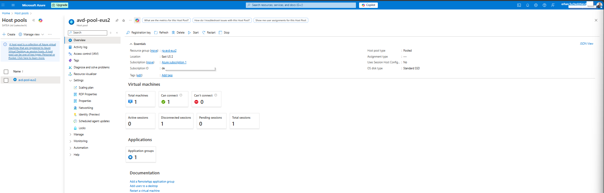
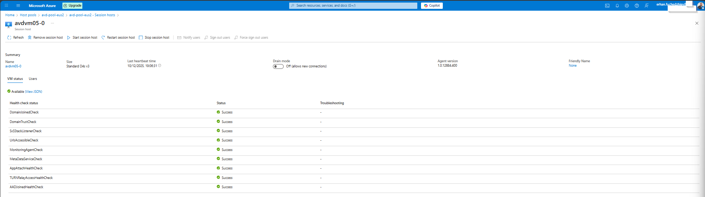
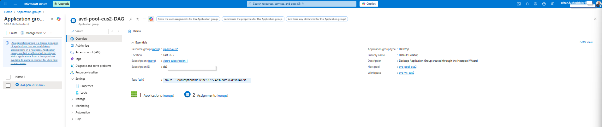
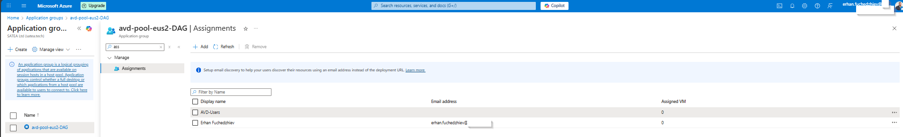

# 06 – Host Pools and Application Groups

In this section of my Azure Virtual Desktop (AVD) deployment, I configure **host pools**, **session hosts**, and **application groups**. A host pool is the logical container for session hosts, while application groups define which resources users can access—either a **full desktop** or individual **RemoteApps**.

This documentation includes screenshots from the actual deployment steps.

---

## Overview

A **host pool** contains one or more Azure VMs used as session hosts in AVD. Application groups define what those hosts present to users:

- **Desktop Application Group (DAG)** → Provides a full Windows desktop  
- **RemoteApp Application Group (RAG)** → Publishes individual applications  

In my deployment, I configured:

- One **pooled** host pool  
- One **session host VM**  
- A default **Desktop Application Group**  
- User assignments through Azure AD  

---

## 1. Host Pool Overview

The host pool overview shows general status, pool type, VM availability, and configuration.

Key details:

- **Host pool type:** Pooled  
- **Location:** East US 2  
- **Total machines:** 1  
- **Can connect:** Yes  
- **Application groups:** 1  
- **Resource group:** rg-avd-eus2  

---

## 2. Session Host Health & Registration

I verify that the session host successfully registered and passed all health checks.

Health checks include:

- DomainJoinedCheck → Success  
- DomainTrustCheck → Success  
- MonitoringAgentCheck → Success  
- TURNRelayAccessHealthCheck → Success  
- AADJoinedHealthCheck → Success  
- AppAttachHealthCheck → Success  

The VM is running, drain mode is off, and the AVD agent version is up to date.

---

## 3. Desktop Application Group Overview

Each host pool includes a **Desktop Application Group**, which exposes a full desktop session to users.

Information shown:

- **Application group type:** Desktop  
- **Host pool:** avd-pool-eus2  
- **Workspace:** avd-ws-eus2  
- **Applications:** 1 (SessionDesktop)  
- **Assignments:** 2  

---

## 4. Application Group Assignments

Users must be assigned to an application group in order to access AVD resources.

Assignments include:

- **AVD-Users** (Azure AD group)  
- **erhan.fuchedzhiev** (User)  

These users can now sign in using the Remote Desktop client or the AVD web client.

---

## Conclusion

In this part of the AVD deployment, I completed:

- Configuration and validation of the **host pool**
- Health verification of the **session host**  
- Review of the **Desktop Application Group**  
- Assignment of users to allow desktop access  

The AVD environment is now functional and ready for user connections.

---

