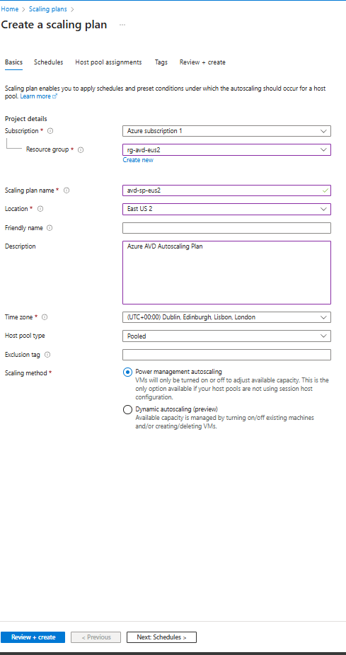
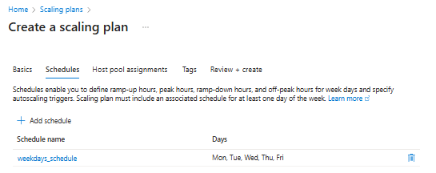
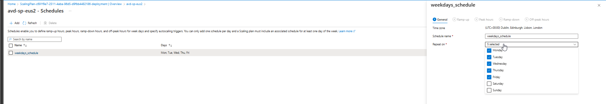
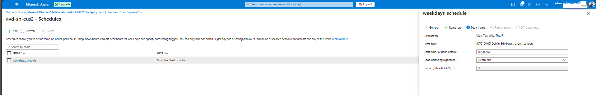
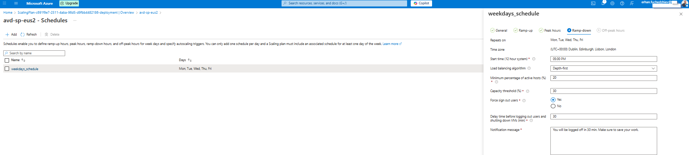
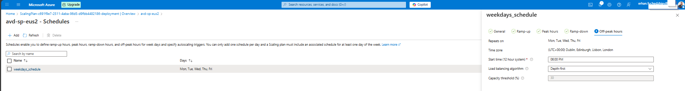
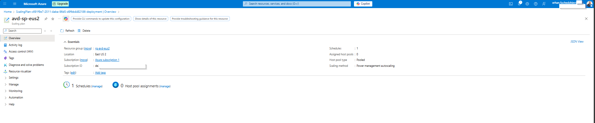

# 07 — Scaling and Cost Optimisation

In this section, I configure **Azure Virtual Desktop (AVD) autoscaling** to optimise cost and ensure that my environment always provides the right amount of compute during business hours.  
By using Azure Scaling Plans, I can automatically start, stop, and scale my session hosts based on schedules and user demand.

---

## 1. Create a Scaling Plan

I start by navigating in the Azure Portal to:

**Azure Portal → Scaling plans → Create**

I configure the **Basics** tab as shown below:

Key configuration I used:

- **Subscription:** Azure subscription 1  
- **Resource Group:** rg-avd-eus2  
- **Scaling plan name:** avd-sp-eus2  
- **Location:** East US 2  
- **Scaling method:** Power management autoscaling  
- **Host pool type:** Pooled  

This method controls the power state of my session hosts based on utilisation.

---

## 2. Add a Schedule

Each scaling plan requires at least one schedule.  
I created a weekday schedule that covers **Monday to Friday**.

This schedule defines:

- Ramp-up  
- Peak hours  
- Ramp-down  
- Off-peak hours  

---

## 3. Configure Schedule Details

### 3.1 General Tab

Here I specify the schedule name, active days, and time zone.

---

### 3.2 Ramp-up (Start of Day)

Ramp-up ensures that the minimum number of hosts are powered on before my users start logging in.

Settings I configured:

- **Start time:** 08:00 AM  
- **Load balancing algorithm:** Depth-first  
- **Minimum percentage of hosts:** 20%  
- **Capacity threshold:** 60%  

---

### 3.3 Peak Hours

Peak hours represent the main working window where most of the user activity occurs.

Settings I configured:

- **Start time:** 09:00 AM  
- **Load balancing:** Depth-first  
- **Capacity threshold:** 60%  

---

### 3.4 Ramp-down (End of Workday)

During Ramp-down, I consolidate users onto fewer hosts and prepare VMs for shutdown.

Settings I configured:

- **Start time:** 05:00 PM  
- **Load balancing:** Depth-first  
- **Minimum percentage of active hosts:** 20%  
- **Capacity threshold:** 30%  
- **Force logoff users:** Yes  
- **Grace period:** 30 minutes  

This helps me gradually reduce capacity as user demand drops.

---

### 3.5 Off-peak Hours (After-hours shutdown)

In Off-peak hours, my environment goes into cost-saving mode and shuts down all unnecessary hosts.

Settings I configured:

- **Start time:** 06:00 PM  
- **Load balancing:** Depth-first  
- **Capacity threshold:** 30%  
- **Minimum hosts:** 0%  

This ensures I save the maximum amount of compute cost during non-business hours.

---

## 4. Final Scaling Plan Overview

After creating the plan, Azure displays a summary view.

This confirms:

- My scaling plan has been deployed  
- My schedules are active  
- The scaling method is applied  
- Host pool assignments are ready  

---

## 5. Summary of My Scaling Logic

| Time | Phase | Behavior |
|------|--------|-----------|
| **08:00** | Ramp-up | Minimum VMs turned on |
| **09:00–17:00** | Peak hours | Full capacity available |
| **17:00–18:00** | Ramp-down | Users consolidated, VMs begin draining |
| **After 18:00** | Off-peak | VMs shut down when idle |

This schedule ensures:

- High performance for my users during the day  
- Automated shutdowns when demand decreases  
- Significant cost savings in my AVD environment  

---

## Result

My AVD host pool now uses **intelligent autoscaling**, reducing unnecessary VM runtime and lowering overall operational cost.

I can edit and fine-tune this configuration at any time as my environment grows or user patterns change.
