# 08 — Security, Hardening and Monitoring

## Overview
In this article, I document how I secured and hardened my Azure Virtual Desktop (AVD) environment following Microsoft best practices. I focused on identity and access controls (Conditional Access, RBAC), network security (Private Endpoints for FSLogix), session host hardening (encryption), FSLogix storage security, and monitoring/diagnostics (Log Analytics + AVD diagnostics).

---

## 1. Identity and Access Hardening

### 1.1 Conditional Access
I implemented Conditional Access policies to ensure only trusted identities and devices can access Azure Virtual Desktop. My baseline includes requiring MFA, enforcing device compliance, and blocking legacy authentication. This mitigates account takeover risks and enforces strong posture at sign-in.

**Overview of Conditional Access policies (policy list):**  

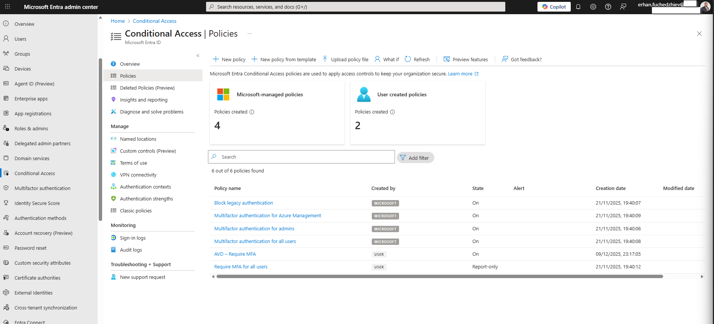

**Detailed view of “Require MFA for AVD” policy (assignments, conditions, grant controls):**  

**What I enforce:**
- **Cloud app:** Azure Virtual Desktop  
- **Grant controls:** Require multi-factor authentication  
- **(Optional)** Conditions: Require compliant devices / trusted locations  
- **Policy state:** Enabled (or Report-only during testing)

---

### 1.2 Role-Based Access Control (RBAC)
I applied least privilege across the Resource Group, Host Pool, and Workspace. This ensures admins and operators only have the access they need at the right scope and nothing more.

**Resource Group IAM (who can manage AVD resources at RG scope):**  

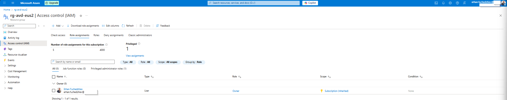

**Host Pool IAM (who can operate AVD at the pool scope; e.g., VM User/Admin Login):**  

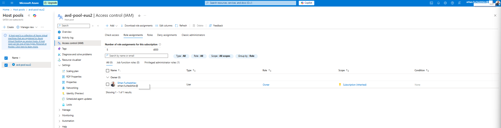

**Workspace IAM (who can publish/manage desktops/apps at the workspace scope):**  

**Principles I follow:**
- Assign **AVD Admin/Operator** roles only where required
- Use **Virtual Machine User Login** and **Virtual Machine Administrator Login** for session host access
- Prefer **group-based assignments** over direct user assignments
- Keep Owner/Contributor limited and inherited roles reviewed

---

## 2. Network Security

### 2.1 Private Endpoints for FSLogix
I created a **Private Endpoint** for my FSLogix storage account to keep profile traffic inside my virtual network. This removes exposure to the public internet and ensures secure access via Private Link.

**Basics configuration (name, NIC, region, resource group):**  

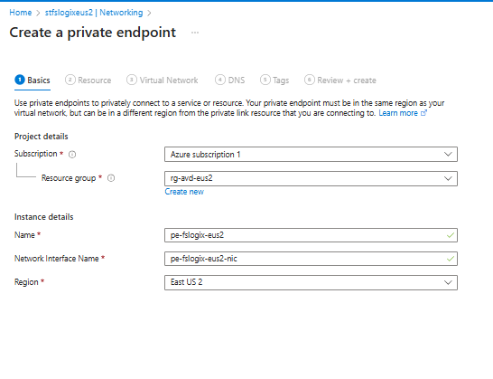

**Resource selection (storage account + correct sub-resource: `file` for Azure Files):** 

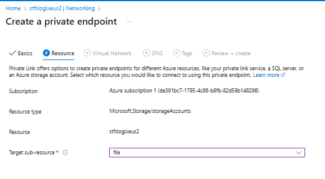

**Virtual Network selection (place endpoint in the same VNet/subnet as AVD hosts):**  

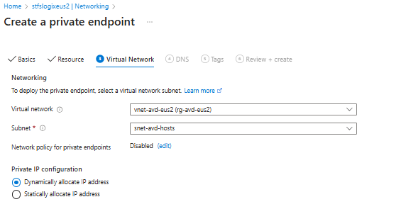

**DNS integration (Private DNS zone `privatelink.file.core.windows.net` for private name resolution):**  

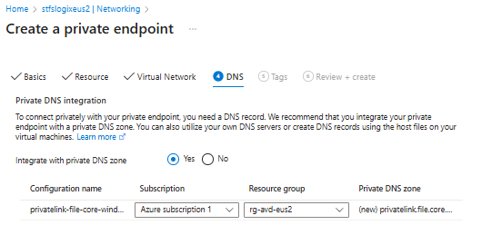

**Deployment confirmation (Succeeded + Connection Approved):**  

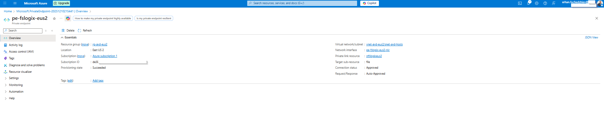

**Why I did this:**
- Enforces **private connectivity** for FSLogix profile containers
- Simplifies **name resolution** to private IPs via Private DNS
- Aligns region and naming with my AVD resources and RG
- Supports compliance for sensitive profile data

---

## 3. Session Host Hardening

### 3.1 Disk Encryption
I verified that my session host OS disks use **Server-Side Encryption with Platform-Managed Keys (SSE + PMK)**. This protects data at rest by default.

**OS Disk encryption status (SSE with PMK on the AVD VM):**  

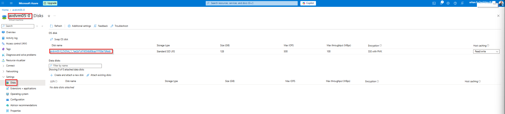

**Additional hardening I apply conceptually:**
- Microsoft Security Baselines (GPO)
- Credential Guard / Exploit Guard
- Attack Surface Reduction (ASR) rules
- Restrict RDP redirections (clipboard/drives/printers) per AVD RDP properties

---

## 4. FSLogix Security

### 4.1 Storage Encryption
I enabled/validated encryption on my FSLogix storage account using **Microsoft-managed keys**. This is a secure default and simpler to operate; CMK can be used if compliance requires.

**Storage account → Encryption (Azure Files):**  

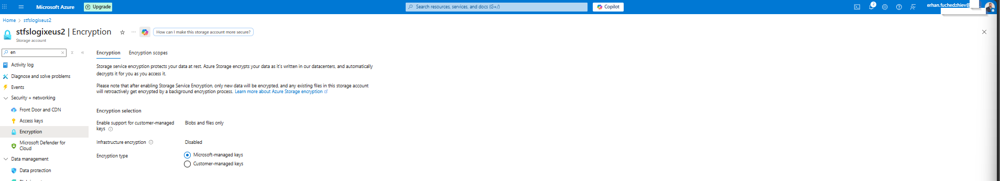

---

## 5. Monitoring and Diagnostics

### 5.1 Log Analytics Workspace
I created a Log Analytics workspace aligned with my AVD resource group and region. This is the foundation for insights and querying AVD diagnostics.

**Workspace creation (name, RG, region):**  

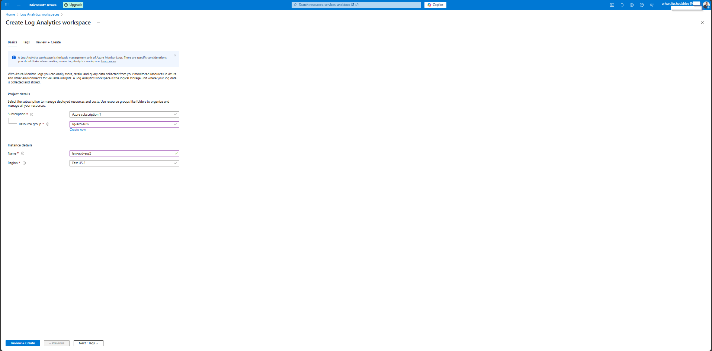

### 5.2 AVD Host Pool Diagnostic Settings
I configured Diagnostic Settings on my Host Pool to send logs to Log Analytics. This gives me visibility into user connections, management actions, agent health, and errors.

**Diagnostic settings configuration (categories + Log Analytics target):** 

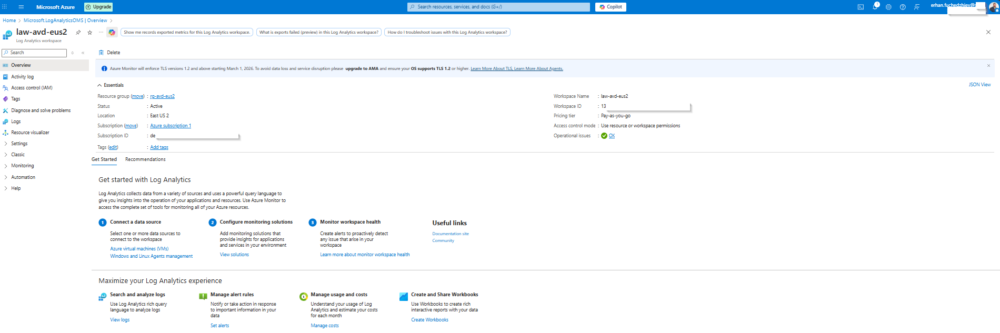

**Diagnostic settings confirmation (active and linked to workspace):**  

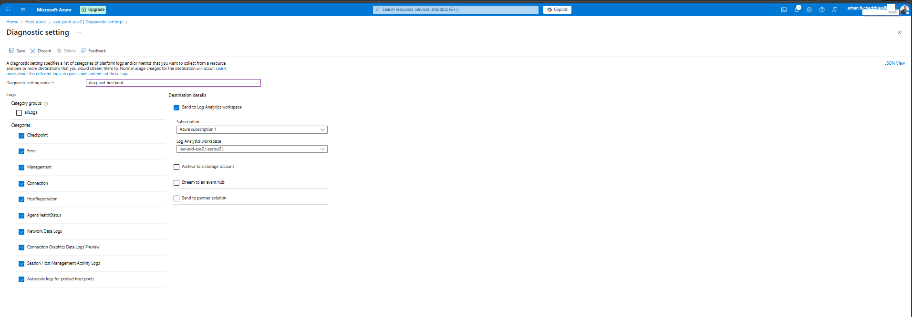

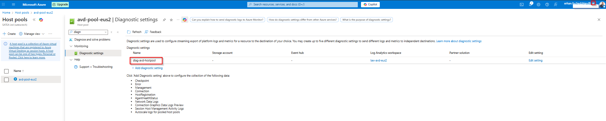

**Categories I enabled:**
- Checkpoint, Error, Management, Connection  
- HostRegistration, AgentHealthStatus  
- Network Data Logs, Connection Graphics Data Logs (Preview)  
- Session Host Management Activity Logs  
- Autoscale logs (for pooled host pools)

---

## Conclusion
I hardened my AVD environment by enforcing Conditional Access and least privilege RBAC, securing FSLogix with Private Endpoints and encryption, validating disk encryption on session hosts, and enabling monitoring via Log Analytics and Host Pool diagnostics. This approach reduces risk, improves operational visibility, and aligns with real-world production practices.
